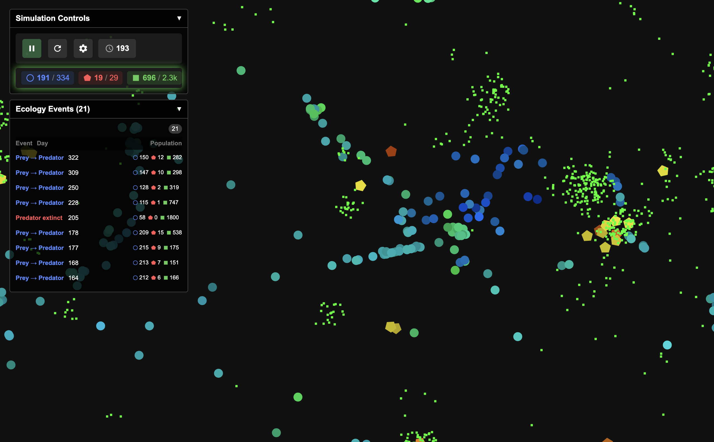

# 🌿 Evolutionary Ecosystem Simulator

A sophisticated browser-based simulation exploring the intricate dynamics of predator-prey relationships, natural selection, and evolutionary adaptation. Watch as digital creatures evolve complex survival strategies in real-time!

## 🎮 Live Demo
[Add your demo link here]


*Screenshot: Blue circles represent prey, yellow pentagons are predators, and green dots are food resources. The UI shows simulation controls, population statistics, and creature attributes.*

## 🌟 Key Features

### 🧬 Dynamic Evolution
- Creatures evolve **four key attributes** that determine their survival strategy:
  - **Strength** (movement speed & combat)
  - **Stealth** (detection & evasion)
  - **Learnability** (adaptation speed)
  - **Longevity** (lifespan & metabolism)
- Watch as populations naturally develop specialized traits:
  - Stealthy prey that excel at predator detection
  - Strong predators that dominate through raw power
  - Balanced generalists that adapt to changing conditions

### 🌍 Rich Environmental Dynamics
- **Seasonal Resource Blooms**: Every 90 days, massive resource clusters appear
- **Adaptive Resource Generation**: Environment responds to population pressures
- **Geographic Specialization**: Limited movement speeds create distinct regional populations
- **Natural Decay**: Resources and creatures age and expire naturally

### 🧪 Complex Interactions
- **Sophisticated Hunting**: Multi-stage predator-prey encounters with stealth and strength checks
- **Social Learning**: Creatures can learn from successful neighbors
- **Anti-Clumping Behavior**: Natural territorial spacing
- **Energy Economics**: Realistic metabolism and activity costs

### 🔄 Population Dynamics
- **Boom-Bust Cycles**: Natural population fluctuations
- **Extinction Events**: Populations can die out if they fail to adapt
- **Recovery Mechanics**: Environmental responses help prevent complete ecosystem collapse
- **Species Conversion**: Rare evolutionary jumps between predator and prey roles

## 🔬 Scientific Background

This simulation explores several key ecological and evolutionary concepts:
- Natural selection and adaptation
- Predator-prey population dynamics
- Evolutionary arms races
- Specialized vs. generalist strategies
- Resource competition and territorial behavior
- Population bottlenecks and recovery

## 🎯 Goals of the Project

1. **Educational Value**: Demonstrate fundamental principles of ecology and evolution
2. **Research Platform**: Provide a testbed for studying emergent evolutionary behaviors
3. **Visual Appeal**: Create an engaging visualization of complex natural processes
4. **Computational Efficiency**: Handle hundreds of entities with sophisticated AI in real-time

## 🛠 Technical Implementation

- Built with TypeScript and Three.js
- Entity Component System (ECS) architecture
- Spatial partitioning for efficient collision detection
- Configurable simulation parameters
- Real-time statistics and visualization

## 📊 Observable Phenomena

### Evolutionary Strategies
- Development of "speed demons" vs "stealth masters"
- Formation of territorial hunting grounds
- Emergence of specialized survival strategies

### Population Patterns
- Predator-prey cycles
- Geographic specialization
- Extinction and recolonization events
- Learning cascades through populations

### Environmental Adaptation
- Resource clustering effects
- Seasonal migration patterns
- Niche exploitation
- Territorial boundaries

## 🚀 Getting Started

```bash
# Clone the repository
git clone [your-repo-url]

# Install dependencies
npm install

# Start the development server
npm run dev
```

## 📖 Configuration

The simulation is highly configurable through `src/config.ts`. Key parameters include:
- Initial population sizes
- Creature attributes and energy costs
- Environmental settings
- Learning and reproduction rates
- Resource generation rules

## 🤝 Contributing

Contributions are welcome! Some areas for potential enhancement:
- Additional creature attributes
- New environmental factors
- Enhanced visualization options
- Performance optimizations
- Data collection and analysis tools

## 📜 License

MIT License

## 🙏 Acknowledgments

This project draws inspiration from:
- Classic predator-prey models (Lotka-Volterra equations)
- Modern ecological research
- Various open-source evolution simulators

---

*"In nature, nothing exists alone." - Rachel Carson* 